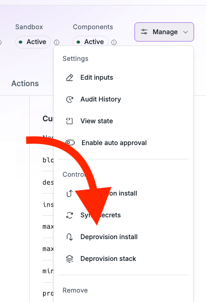

# Frequently Asked Questions

(sorted by category)

CLI

How do I create a new app and sync it?

Use the <code>nuon apps create -n <your app name> --no-template</code> command to create a new app, and then use <code>nuon apps sync .</code> to sync the local directory of app config files with the app.

How do upload my App Config to Nuon?

<code>nuon apps sync .</code> does some validation and knows how to construct a config from a well-known directory structure.

> Note: The directory that you run `nuon apps sync` in, must be the same name as the app created in `nuon apps create -n <your app name> --no-template`.

Where are org, app and install current contexts stored?

The current contexts are stored in the local <code>~/.nuon</code> file along with the Nuon api key.

How do I see detailed error messages?

Set the environment variable <code>export NUON_DEBUG=true</code> then use the CLI commands as usual. This will enable debug logging and show more detailed error messages.

How do I delete Components?

Components must be deleted individually. If a component is dependent on another component, it will fail to delete, but the CLI will tell you which components must be deleted first in array output. First list the Components<code>nuon components list -a <your app name></code> then delete the Component with <code>nuon components list -a <your app name></code>

How do I delete an App?

If your App Config has Components, the App will say it is deleted but it is in a queue until the Components are individually deleted, then the App will delete. First, list your Apps with <code>nuon apps list</code> then <code>nuon apps delete -a <your app name> --confirm</code>

Dashboard UI

I started an install, but it's waiting for me to do something.

Remember that the install runner is a VM that is created in your cloud account. You need to click on the link in the Nuon dashboard to open the CloudFormation stack or equivalent IaC in your cloud account. This will create the VM and start the install runner service. Once that is done, the install will continue automatically.

I just spun up the eks-simple example. It worked!
How can I tear it down?

Nuon can gracefully deprovision. You'll see a drop-down for that. It will take a while since removing node groups and an EKS cluster takes a while in AWS.
Note, this does not remove the Runner VM, so the customer must go into their AWS CloudFormation stack and delete it to completely remove the VM and VPC.
If some reason, you need to manually teardown, our sandbox repos have an error-destroy.sh - it's documented here.
https://docs.nuon.co/get-started/create-your-first-app#deprovision-the-install

Architecture

Do I have to give the Runner cross-account permissions? That's a big no in our organization.

No, with Nuon, you do not have to give cross-account permissions.
How it works is during a customer Install, we generate an AWS CloudFormation stack which the customer uses their AWS profile and credentials to run.
It creates a VPC, ASG and EC2 VM instance with Docker and a container with the Nuon Runner.
The App Config defines IAM roles and boundaries for what the Runner can or can't do in the customer's cloud account. Like Provision and De-provision have elevated permissions to create infrastructure like an EKS cluster, while the Maintenance role is reduced permissions to upgrade the app, run health checks, etc.

AWS

As a customer deploying an app from the Nuon dashboard, how do I tie my AWS access key and secret access key to the app install?

When you click on the Nuon-generated CloudFormation Stack Link in the Nuon dashboard, that opens in the customer's AWS account. The initial install runner and app install is done with the customer's AWS credentials. Nuon never will have access to these credentials.  All of those Nuon control plane activities like creating app configs and building components, leverage the AWS (or equivalent cloud) credentials of Nuon-hosted control plane or the customer-hosted control plane.

